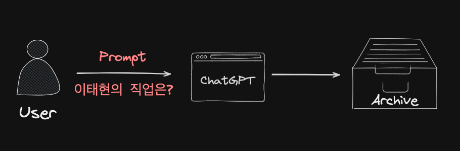
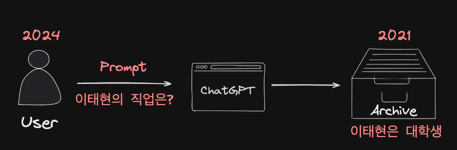
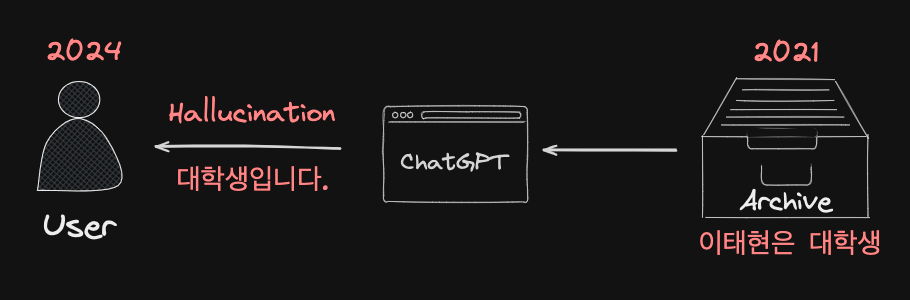
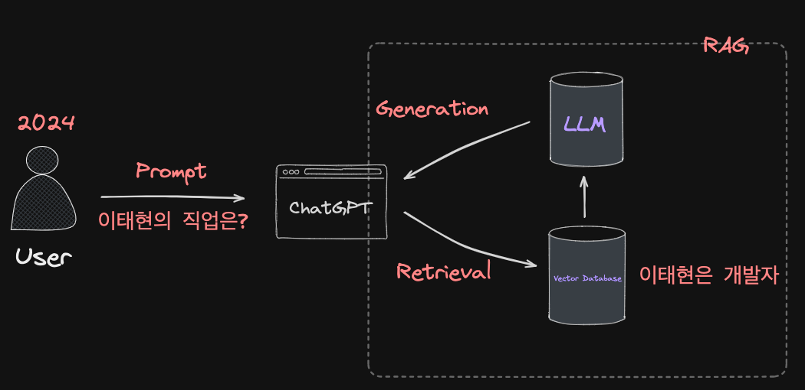
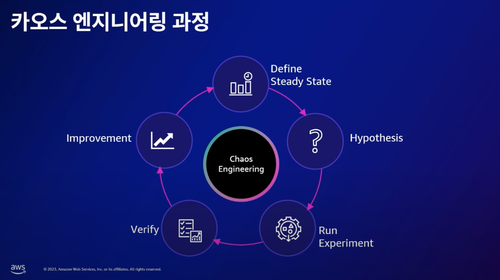
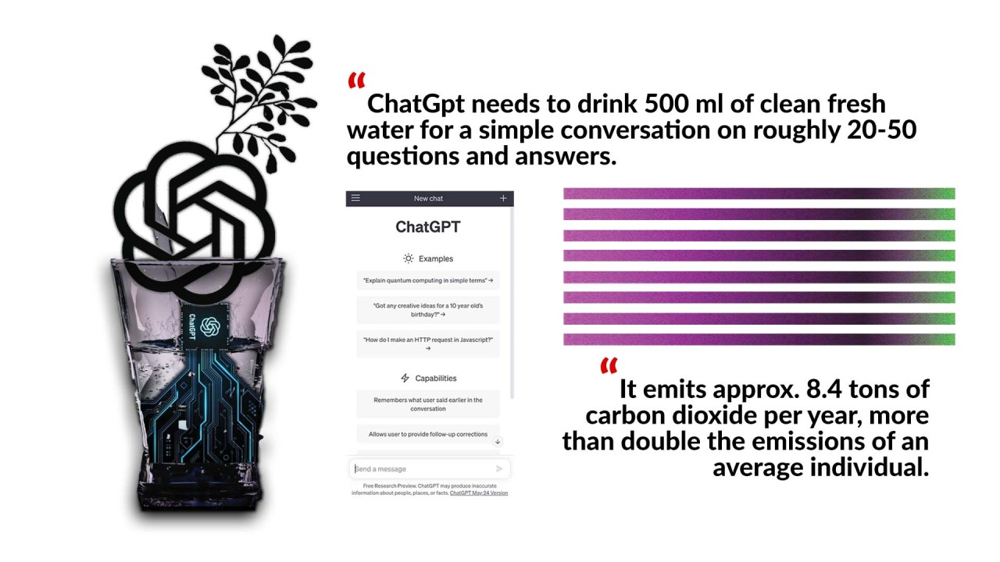
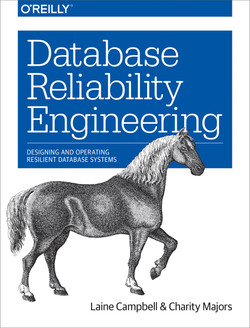

## 01장 신뢰할 수 있고 확장 가능하며 유지보수하기 쉬운 애플리케이션

---

## 들어가며

---

## 현대적 애플리케이션

### : **계산 중심(Compute-Intensive)** 에서 **데이터 중심(Data-Intensive)** 으로

---

## 데이터 중심 애플리케이션의 표준 구성 요소(Standard Building Block)

- **데이터베이스(Database)**
- **캐시(Cache)**
- **검색 색인(Serach Index)**
- **스트림 처리(Stream Processing)**
- **일괄 처리(Batch Processing)**

---

## 그런데 왜 **데이터 시스템** 인가?

---

## One Size Fits All?

> ['One Size Fits All': An Idea Whose Time Has Come and Gone](https://cs.brown.edu/~ugur/fits_all.pdf)

---

## 분야별 특화된 데이터베이스 엔진

- Data warehouses
- Sensor netowkrs
- Text search
- Scientific database
- XML databases

---

## 2023년의 트렌드
### : **벡터 데이터베이스(Vecotr Database)**

---

## LLM(Large Langauge Model)

---

---

---

최신화 되지 못한 정보로 인해 **할루시네이션** 현상 발생!

---

---

---

## RAG(Retrieval-Augmented Generation)

---

벡터 데이터베이스를 활용해서 빠른 검색을 통해 기존 LLM의 할루시네이션 현상 극복

---

## 기존 관계형 데이터베이스는 이를 해결할 수 없는가?

---

## PostgreSQL

### : Postgres 엔진 위에 사용할 수 있는 오픈소스 [pgvector](https://github.com/pgvector/pgvector) 존재

---

## 세 가지 관심사

---

## 신뢰성(Reliability)

---

## 소프트웨어에 대한 일반적 기대치

---

## 소프트웨어에 대한 일반적 기대치

- 애플리케이션은 사용자가 기대한 기능을 수행한다.

---

## 소프트웨어에 대한 일반적 기대치

- 애플리케이션은 사용자가 기대한 기능을 수행한다.
- 시스템은 사용자가 범한 실수나 예상치 못한 소프트웨어 사용법을 허용할 수 있다.

---

## 소프트웨어에 대한 일반적 기대치

- 애플리케이션은 사용자가 기대한 기능을 수행한다.
- 시스템은 사용자가 범한 실수나 예상치 못한 소프트웨어 사용법을 허용할 수 있다.
- 시스템 성능은 예상된 부하와 데이터 양에서 필수적인 사용 사례를 충분히 만족한다.

---
## 소프트웨어에 대한 일반적 기대치

- 애플리케이션은 사용자가 기대한 기능을 수행한다.
- 시스템은 사용자가 범한 실수나 예상치 못한 소프트웨어 사용법을 허용할 수 있다.
- 시스템 성능은 예상된 부하와 데이터 양에서 필수적인 사용 사례를 충분히 만족한다.
- 시스템은 허가되지 않은 접근과 오남용을 방지한다.

---

## 소프트웨어에 대한 일반적 기대치

### : **무언가 잘못**되었더라도 **지속적으로 올바르게 동작**해야 하는 시스템

---

## 소프트웨어에 대한 일반적 기대치

### : **무언가 잘못**되었더라도 **지속적으로 올바르게 동작**해야 하는 시스템

### : **결함(Fault)** 에 대한 **탄력성(Resilience)** 이 확보된 시스템

---

## 신뢰성(Reliability)과 가용성(Availability)

---

## 신뢰성(Reliability)

### : 하드웨어나 소프트웨어가 고장 나는 빈도나 고장 기간을 나타내는 개념

---

## 가용성(Availability)

### : 사용자 입장에서 볼 때 시스템을 어느 정도 사용할 수 있는지를 나타내는 개념

---

## 신뢰성이 99%인 시스템과 가용성이 99%인 시스템

---

## 신뢰성과 가용성 지표

### : 가용성이 99%라는 것은 **1년 중 3일은 서비스 다운이 발생**한다는 의미

---

## 신뢰성과 가용성 지표

### : 가용성이 99%라는 것은 **1년 중 3일은 서비스 다운이 발생**한다는 의미

### : AWS RDS의 SLA(Serivce Level Agreement)는 **99.95%**

---

## 결합의 세 가지 종류

---

## 결합의 세 가지 종류

### 1. 하드웨어 결함: 무작위적이고 비상관 관계

---

## 결합의 세 가지 종류

### 1. 하드웨어 결함: 무작위적이고 비상관 관계

### 2. 소프트웨어 결함: 체계적이고 다루기 어려운 일

---

## 결합의 세 가지 종류

### 1. 하드웨어: 무작위적이고 비상관 관계

### 2. 소프트웨어 버그: 체계적이고 다루기 어려운 일

### 3. 사람: 가끔씩 불가피한 실수 발생

---

## **결함(Fault)** 과 **장애(Failure)**

---

## 결함(Fault)

### : 사양에서 벗어난 시스템의 한 구성 요소

---

## 장애(Failure)

### : 사용자에게 필요한 서비스를 제공하지 못하고 시스템 전체가 멈춘 경우

---

## 결함이 장애로 번지지 않게 하기 위한 노력 필요

### : 장애는 곧 치명적인 **비즈니스 손실**을 의미

---

## 결함이 장애로 번지지 않게 하기 위한 노력 필요

### : 장애는 곧 치명적인 **비즈니스 손실**을 의미

### : **탄력성(Resilient)** 확보

---

## 탄력성 확보를 위한 노력

### : **카오스 엔지니어링(Chaos Engineering)**

---

## 탄력성 확보를 위한 노력

### : **카오스 엔지니어링(Chaos Engineering)**

### : 고의적으로 결함을 유도하여 지속적으로 타련성을 지닌 시스템을 유지

---

## 카오스 엔지니어링(Chaos Engineering)

### : [AWS Fault Injection Simulator를 활용한 EKS 안정성 검증하기](https://youtu.be/QJdp2rlADCs?t=1187)

---

---

## 카오스 엔지니어링 과정

---

## 카오스 엔지니어링 과정

1. 안정적 서비스 상태 정의

---

## 카오스 엔지니어링 과정

1. 안정적 서비스 상태 정의
2. 가설 정의

---

## 카오스 엔지니어링 과정

1. 안정적 서비스 상태 정의
2. 가설 정의
3. 실험 진행

---

## 카오스 엔지니어링 과정

1. 안정적 서비스 상태 정의
2. 가설 정의
3. 실험 진행
4. 실험 결과를 바탕으로 가설 검증

---

## 카오스 엔지니어링 과정

1. 안정적 서비스 상태 정의
2. 가설 정의
3. 실험 진행
4. 실험 결과를 바탕으로 가설 검증
5. 개선점 도출

---

## 탄력성 확보를 위한 노력

### : **관측 가시성(Observability)**

---

## 탄력성 확보를 위한 노력

### : **관측 가시성(Observability)**

### : 관측 가시성을 통해 개선이 필요한 부분 발견 용이

---

## 확장성(Scalability)

---

## 확장성(Scalability)

### : **확장 가능성** 이 아닌 **추가 부하를 대처하기 위한 자원** 에 대한 이야기

---

## 두 가지 확장 방법

---

## 두 가지 확장 방법

### 1. 용량 확장(Scaling Up) = 수직 확장(Vertical Scaling): 강력한 장비로 이동

---

## 두 가지 확장 방법

### 1. 용량 확장(Scaling Up) = 수직 확장(Vertical Scaling): 강력한 장비로 이동

### 2. 규모 확장(Scaling Out) = 수평 확장(Horizontal Scaling): 다수의 장비로 분산

---

## 현실적인 확장 방법

### : 수직 확장은 간단하지만 비싸기 때문에 결국 **적절한 사양의 장비로 수평 확장**을 진행

---

## 데이터베이스의 다중화

### **클러스터링(Clustering)**, **레플리케이션(Replication)**, 그리고 **샤딩(Sharding)**

---

## 클러스터링(Clustering)

### : **데이터베이스 서버만 다중화**하고 저장소는 하나로 유지 = Shared Disk

### : 저장소는 하나만 유지하기 때문에 **정합성을 신경 쓰지 않아도 되는 장점** 존재

---

## 클러스터링(Clustering)의 종류

### **Active-Active 클러스터** vs **Active-Standy 클러스터**

---

## Active-Active 클러스터

### : 클러스터를 구성하는 컴포넌트를 동시에 가동

### : 시스템 다운 시간이 짧으며, 성능이 좋다는 장점

### : 단일 저장소이기 때문에 **저장소가 병목**이 될 수 있는 단점 존재

---

## Active-Standby 클러스터

### : 활성(Active) 컴포넌트 외 나머지 컴포넌트는 대기(Standby)

### : Active 컴포넌트에서 장애가 발생할 경우 대기 중인 컴포넌트 전환을 위한 대기 시간 존재

### : Cold-Standby 및 Hot-Standby 방식 존재

---

## Active-Standby 클러스터의 Cold-Standby 방식

### : 평소에는 대기 중이었다가 Active 컴포넌트가 다운된 시점에 구성

---

## Active-Standby 클러스터의 Hot-Standby 방식

### : 평소에도 Standby 클러스터가 작동

---

## Standby 클러스터가 Active 클러스터의 장애를 인지하는 방법

### : **Heartbeat** 방식을 통해 지속적으로 Active 컴포넌트에 통신 시도

---

## 레플리케이션(Replication)

### : 데이터베이스 서버 뿐만 아니라 **저장소 또한 다중화**

### : 다중화 특성으로 **재난 복구 계획(Disaster Recover Plan)** 으로도 활용

### : **데이터 정합성**에 유의

---

## 샤딩(Sharding, Shared Nothing)

### : 저장소를 공유하는 Shared Disk 형태와 달리 네트워크 이외의 모든 자원을 분리하는 방식

### : 저장소를 공유하지 않기 때문에 각 데이터베이스 서버는 각각 다른 데이터에 접근

### : 장애가 발생했을 때 이어 받아 처리하기 위해 **커버링(Covering)** 구성 필요

---

## 특정 시점에 부하가 몰리는 시스템

### : **탄력성(Elastic) 확보**는 어떻게 할 수 있을까?

---

## 트위터(Twitter)의 부하 처리

---

## 팬아웃(Fanout)

1. 쓰기 시점의 팬아웃(fanout-on-write): 푸쉬 모델(Push Model)
2. 읽기 시점의 팬아웃(fanout-on-read): 풀 모델(Pull Model)

---

## 쓰기 시점의 팬아웃

### : 새로운 포스팅을 기록하는 시점에 갱신

### : 친구가 많은 사용자의 경우 친구 목록을 가져오고 갱신하는 데 많은 시간 소요

---

## 읽기 시점의 팬아웃

### : 새로운 포스팅을 읽는 시점에 갱신

### : 포스팅을 읽는 데 많은 시간 소요

---

## 혼합 모델

### : 대부분의 사용자는 쓰기 시점의 팬아웃(푸쉬 모델) 활용

### : 유명인의 경우 읽기 시점의 팬아웃(풀 모델) 활용

---

## 시스템 성능을 파악하는 세 개의 시간

1. 지연 시간(Latency)
2. 처리 시간(Processing Time)
3. 응답 시간(Response Time)

---

## 지연 시간(Latency)

### : 데이터가 전송되는 데 걸리는 시간

---

## 처리 시간(Processing Time)

### : 요청을 처리하는 데 걸리는 시간

---

## 응답 시간(Response Time)

### : 클라이언트 관점에서 요청을 보내고 첫 번째 응답을 받는데 걸리는 시간

---

## 확장성을 갖춘 애플리케이션

### : 애플리케이션의 주요 동작과 그렇지 않은 동작에 대한 가정을 바탕으로 구축

### : 이 가정은 곧 **부하 매개변수**

---

## 유지보수성(Maintainability)

1. 운용성(Operatiblity)
2. 단순성(Simplicity)
3. 발전성(Evolability)

---

## 운용성(Operability)

: **자동화**를 통해 운영팀이 **고부가가치 활동에 집중**할 수 있는 환경을 만들어주는 것

---

## 단순성(Simplicity)

: **좋은 추상화**를 통해 **우발적 복잡도(Accidental Complexity)를 줄이는 것**

---

## 발전성(Evolability)

: **간단하고 이해하기 쉬운 시스템**을 통해 **끊임없이 변하는 요구사항에 대응**하는 것

---

## 추가로 이야기해보면 좋은 주제

### : 비용과 FinOps

### : 수많은 관리형 서비스(Managed Service)가 존재하는 클라우드 서비스 시대

---

## Amazon Aurora Serverless

### : 자동화된 용량 확장 및 축소

---

## 추가로 이야기해보면 좋은 주제

### : 데이터 센터와 환경

---

---

## The Frugal Arechitecture

### : 검소한 아키텍처, 알뜰한 아키텍처

### : [AWS re:Invent 2023 - Keynote with Dr. Werner Vogels](https://youtu.be/UTRBVPvzt9w?t=3839)

---

## 추가로 이야기해보면 좋은 주제

### DBRE(Database Reliability Engineering)

---

### *오늘날의 데이터베이스 전문가들은 관리자가 아니라 **엔지니어**가 돼야 한다. 이들은 **필요하면 구현**하고 만들어낸다. 데브옵스(DevOps)를 수행하는 엔지이너는 "**우리 모두가 함께 참여**했으므로 특정한 누군가의 잘못은 없다."라는 원칙을 지닌다.*